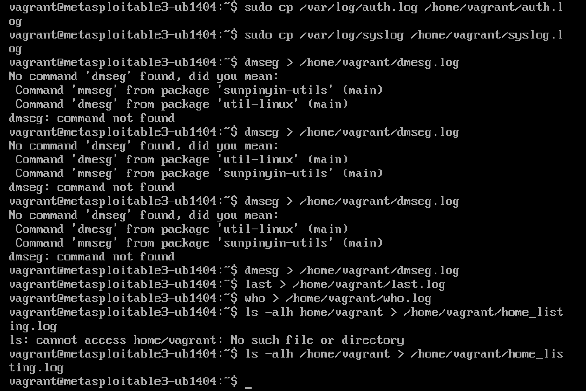
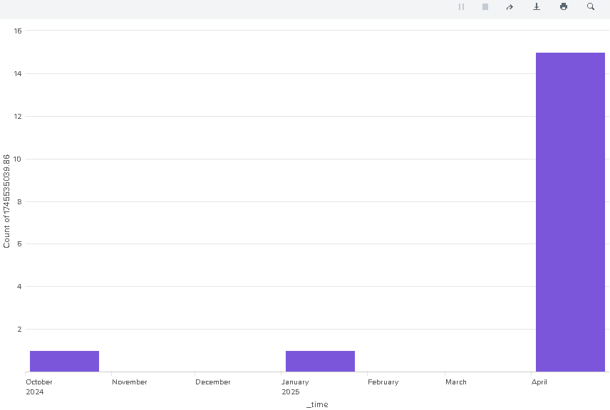
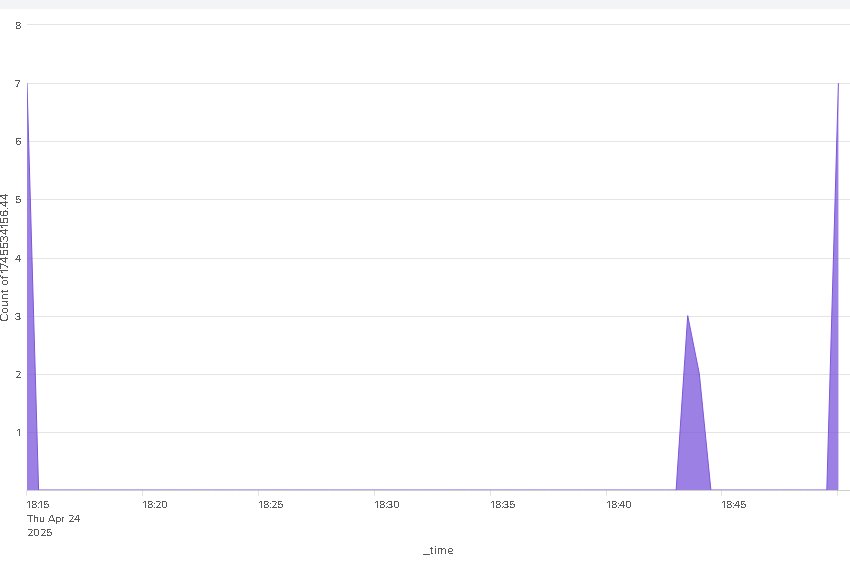
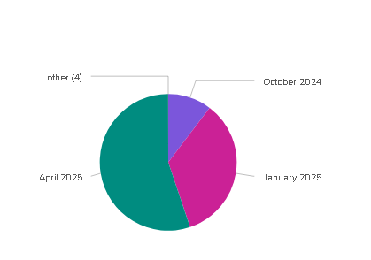
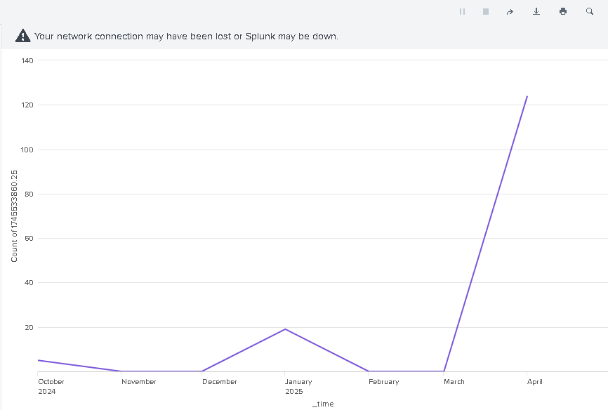
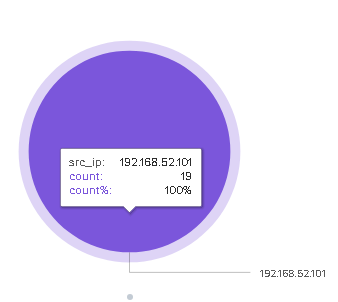
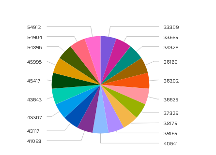

#Phase 2: Visual Analysis with a SIEM Dashboard

##Overview

In Phase 2, we collect and visualize security logs to analyze attack patterns and behavior using a SIEM (Security Information and Event Management) platform.

We gather logs from the victim environment and integrate them into Splunk, a recommended SIEM tool, to visualize and compare the attacks.
- **Victim Environment::**  Metasploitable3 VM (UTM)
- **Attacker Environment:**  Kali Linux VM (VirtualBox)
- **Host Machine:** macOS M1 (for VMs) and Windows (for Splunk analysis)

SIEM Setup

Before performing log analysis, the setup included connecting both the attacker and victim VMs:

•	Network Setup:
Both Kali Linux (attacker) and Metasploitable3 (victim) were configured using Bridged Networking to ensure they were on the same local network.

•	IP Addressing:
Each machine was assigned an IP address to enable communication between them.

•	Log Collection:
Logs (such as /var/log/auth.log, /var/log/syslog) were collected from the victim machine (Metasploitable3).

•	Splunk Installation:
Since Splunk did not function correctly on macOS M1, Splunk was installed on a Windows machine for proper operation.

•	Log Upload:
All collected logs were uploaded into Splunk for analysis.

Task 2.1: SIEM Integration

Steps:
	1.	Prepare the logs from the victim machine:
		Copy auth.log, syslog, and any other relevant security logs.
	
    
    
	2.	Transfer the logs to the Windows machine hosting Splunk.

	3.	Open Splunk and add a new data source:
		Select Upload.
		Browse and upload the victim environment logs.

	4.	Set the sourcetype to “automatic” or customize it to fit log formats.

	5.	Index the data under a new index (e.g., victim_logs).

Task 2.2: Log Visualization

Steps:
	1.	In Splunk, use the Search & Reporting App.

	2.	Perform searches to analyze logs:
		Example Query: index=victim_logs "Accepted password"

	3.	Create charts, tables, or graphs to display:
		Number of failed login attempts
		Source IP addresses
		Times of the attack
        
  **Screenshots:** 
        number of accepted password over time
        
        numbers of attempt of failed password over time
        
        time for abnormal system behaviour
        
        all ssh login attempts
        
        attackers ip who tries to login
        
        login attempts by port number
        
       
        
       
Task 2.3: Attack Comparison

Steps:
	1.	Review the patterns detected from the victim environment logs.
	2.	Compare the observed behavior against the attack methods executed in Phase 1 (SSH brute force via Metasploit and custom Python script).
    In Phase 1, we used Metasploit and a Python script to try many passwords on the victim machine. The victim logs showed lots of failed login attempts close together, then a few successful ones. All the attacks came from one IP address (192.168.52.101), which matches the attacker’s machine. This confirms the attacks were the same as what we did in Phase 1.   
	3.	Highlight findings:
	•	Time of attack vs time of brute-force execution
    The logs showed spikes in failed password attempts around the same period the brute-force attacks were launched (April 2025). 
    In particular, around April 24th, 2025 during evening hours (18:15–18:50), which matches our Phase 1 manual attack session.  
	•	Number of login attempts
    Over 120+ failed login attempts were recorded before success, showing the automated nature of brute-forcing.   
	•	Usernames targeted
    From the Splunk searches, many failed attempts targeted the vagrant user and some default Linux usernames.
	•	IP addresses used in the attack
    All attempts were recorded from a single IP address: 192.168.52.101 — the attacker’s Kali Linux machine.   

